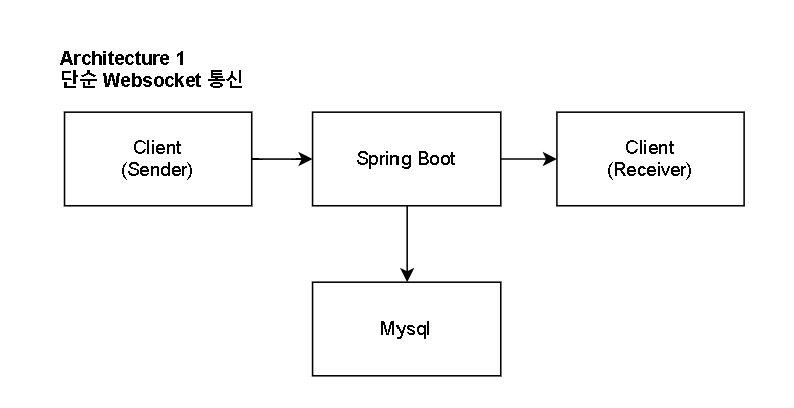

# Report 1
## ⏰ Duration
* 2025-02-24 - 

## 🌟 Architecture & Directionality
### Architecture

* Spring Boot 에서 WS를 통해서 양방향 통신을 하며, Mysql 에 바로 이를 저장
* 모든 작업이 동기적 으로 처리

### Directionality
* Stomp vs Websocket

    | 기준 | WebSocket | STOMP |
    |------|----------|-------|
    | **Latency (지연시간)** | 낮음 (즉시 전송) | 높음 (헤더 + 메시지 라우팅) |
    | **Throughput (처리량)** | 높음 | 상대적으로 낮음 |
    | **Overhead (부하)** | 적음 (바이너리/텍스트 프레임) | 많음 (헤더 포함) |
    | **메시지 브로커 필요 여부** | 필요 없음 | 필요 (RabbitMQ, Kafka 등) |
    | **확장성 (Scale-out)** | 직접 구현 필요 | 메시지 브로커 활용 가능 |

    > 고성능 채팅 서버를 목표로 높은 tps 를 달성하고자 하기 때문에, 성능에 자유로운 형식을 사용하는 것이 좋다고 판단
  > Stomp 에 비해서 Websocket을 사용하여 이를 직접적으로 구현하는 것이 좋다고 생각하였습니다.
  
  
초기 시도인 만큼, 모든 작업을 동기로 처리